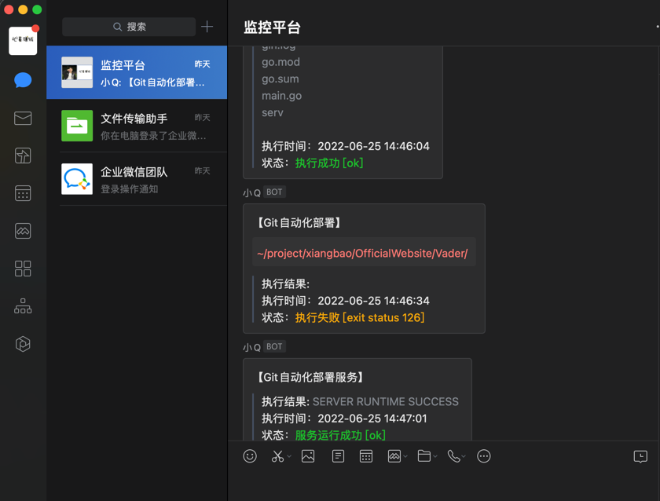

# 🎯 分布式Git仓库部署服务

## 技术选型
|名称|功能|  说明   |
|----|----|:-----:|
|Gin|服务端|  ---  |
|Redis|消息订阅|  ---  |

## 目录说明
```integrationperformancetest
├── git-devops
│   ├── config.ini // 配置redis、企业微信机器人webhoook、自定义执行指令
│   ├── gin.log    // 运行日志
│   ├── go.mod
│   ├── go.sum
│   ├── main.go    // 主程序
│   └── serv-linux // 二进制Linux可执行文件（更改源码后可重新生成）
```
## 使用说明
1. 配置企业微信机器人wedhook
2. 配置redis以及执行命令
3. go run main.go //执行服务
4. 到自己到git仓库中找到配置webhook的地方配置{host}/api/git/command?zl=你配置的指令

## 🍬 效果


## 🧩 视频教程
[👇戳我进入传送门](https://www.bilibili.com/video/BV1tB4y1q7Wa/)
